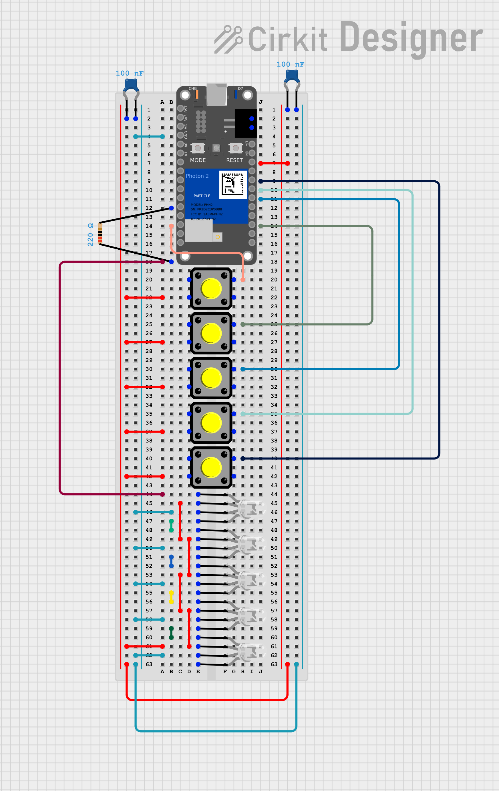

# ParticleLED_Game

Overview

PixelPlay is a game system that uses a microcontroller, five LEDs, and five buttons to offer four different game modes. Each mode challenges different skills such as memory, reaction time, and coordination. You start in what is known as "the Lobby" until you press one of the buttons. Anyone can create and play PixelPlay by wiring and putting together the hardware and uploading the code to their microcontroller. Once wired correctly, compile and flash the code; if done correctly, PixelPlay should be functional. I used the VS Code Particle Workbench for this project, and I highly recommend using it for a smoother development experience.

This includes a website, that you can open and read about PixelPlay. You can open it here [PixelPlay](Website/Main.html)

Game Modes
1. The Reaction Game Mode
The Reaction Game is the first game mode of PixelPlay. It is played by pressing the button corresponding to the green LED in the lobby. The goal is to press the corresponding button when one of the five LEDs lights up randomly. After the player presses the button correctly for fifteen LEDs in a row, the next round starts, and the time limit is reduced. If the player fails to press the button in time, they are returned to the lobby, and their round is displayed.

2. The Memory Game Mode
The Memory Game is the second game mode of PixelPlay. It is played by pressing the button corresponding to the purple LED in the lobby. The goal is to memorize a sequence of random LEDs, with the number of LEDs in the sequence increasing with each round. Each time the player correctly repeats the sequence, they move on to the next round; the sequence stays the same, but one additional random LED is added to the end.

3. The Reaction & Memory Game Mode
The Reaction and Memory Game is the third game mode of PixelPlay. It is played by pressing the button corresponding to the blue LED in the lobby. It works by presenting the player with a sequence of four, six, or eight LEDs, depending on the round. The player must then repeat the sequence in time to move on to the next round, with the time limit decreasing each round.

4. Whack-A-Mole Game Mode
Whack-A-Mole is the fourth game mode of PixelPlay. It is played by pressing the button corresponding to the red LED in the lobby. The goal is to press the button when one of the five LEDs lights up randomly. The time limit is thirty seconds, and the objective is to press as many buttons corresponding to the LEDs as possible within the allotted time.

Additional Features
You may also click the middle button (which does not correspond to any game mode) to randomize the LED color. If you want to play with a certain color, go to the [LED Changer](Website/LED_Changer.html) page on the PixelPlay website.

Hardware & Wiring
This project was made using a Photon 2 Particle microcontroller, and I recommend using it if you plan to implement this project. I also used a four-pin LED from AdaFruit, as well as the Neopixel library. If you are using a Photon 2, feel free to copy my wiring or set it up however you like. Note that my wiring is slightly unusual due to my D0 and D1 pins being fried, and because I plan to implement a display board soon. If you wire it differently than I did, you may need to change the input button pins.

To connect your Photon 2 to the website(or other microcontroller), you will need to input your device ID and access token in the [script.js](Website/script.js) file. If you plan on using a different microcontroller, you may encounter issues with this code and will require some editing; however, the logic should remain the same.

Here is my wiring diagram, feel free to wire it as shown:

If you have any issues, feel free to message me!

Credits & Photo Attributions:
puzzle icons PNG Designed By EncoderXSolutions from https://pngtree.com/freepng/vector-puzzle-piece-icon_4187298.html?sol=downref&id=bef
brain PNG Designed By 588ku from https://pngtree.com/freepng/plan-of-a-brain_4430704.html?sol=downref&id=bef
timer clipart PNG Designed By 588ku from https://pngtree.com/freepng/flat-stopwatch_4419504.html?sol=downref&id=bef
hammer PNG Designed By 588ku from https://pngtree.com/freepng/wooden-cartoon-hammer_4634513.html?sol=downref&id=bef
